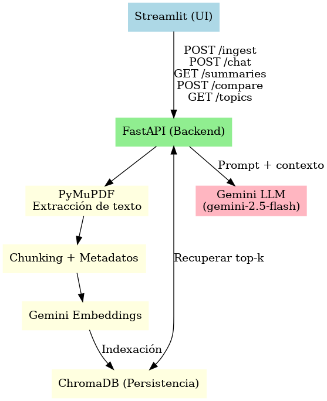

# CatchAI Copilot

Copiloto conversacional para subir hasta 5 PDFs y hacer preguntas en lenguaje natural sobre su contenido. Las respuestas son contextuales y muestran pasajes usados. Incluye resúmenes, comparación entre documentos y agrupación por temas.

## Demo rápido
- `docker compose up --build`
- UI: http://localhost:8501  
- API (Swagger): http://localhost:8000/docs 

## Arquitectura
- **Frontend**: Streamlit
- **Backend**: FastAPI
- **Embeddings y LLM**: Google Gemini (`text-embedding-004`, `gemini-2.5-flash`)
- **Vector store**: Chroma (persistente en `./data/chroma`)
- **Contenedores**: Docker Compose (servicios `api` y `ui`)

Streamlit (UI)
- POST /ingest  ──▶ FastAPI ── PyMuPDF ── Chunking ── Embeddings ─▶ Chroma (persist)
- POST /chat    ──▶ FastAPI ── Retrieve top-k ── Prompt orquestado (Devuelve respuesta + fuentes) ─▶ Gemini
- GET  /summaries ─▶ FastAPI ── Gemini (resumen por doc)
- POST /compare   ─▶ FastAPI ── Gemini (comparación 2 docs)
- GET  /topics    ─▶ FastAPI ── KMeans (clusters) + Gemini (etiquetas)

### Orquestación: Flujo conversacional
**INGESTA**
1. El usuario sube PDFs (máx. 5)
2. Backend extrae texto (PyMuPDF)
3. Se divide en chunks solapados y se anexan metadatos (doc_id, filename, chunk).
4. Se generan embeddings (Gemini text-embedding-004) y se indexa en Chroma.

**Pregunta (chat)**
1. Se embebe la pregunta.
2. Se recuperan los k pasajes más relevantes desde Chroma.
3. Se construye un prompt con contexto etiquetado.
4. Se llama a Gemini (gemini-2.5-flash), y se muestra respuesta + fuentes.

**Opcionales incluidos**
- Resúmenes por documento (Gemini).
- Comparación entre 2 documentos (Gemini).
- Temas: KMeans sobre embeddings + Gemini para nombrar cada cluster.

## Justificación técnica
- **FastAPI** por simplicidad, tipado y OpenAPI.  
- **Streamlit** para iteración veloz de UI.  
- **Chroma**: ligero y persistente local.  
- **Gemini**: embeddings y LLM en el mismo proveedor (menor fricción).

## Funcionalidades
- Subida/ingesta (hasta 5 PDFs)
- Chat contextual
- Resúmenes por documento
- Comparación 2 documentos
- Clustering temático (KMeans) 

## Limitaciones actuales
- Sin OCR: PDFs escaneados podrían no extraer texto.
- Sin reranking avanzado (solo similitud vectorial).
- Resúmenes no cacheados por defecto (se recalculan).
- Rate limits del proveedor LLM pueden afectar tiempos.

## Roadmap (mejoras futuras)
- OCR (Tesseract o API externa)
- MMR / reranking (p. ej., Cohere Rerank u otros)
- Cachear resúmenes y respuestas frecuentes
- Exportar respuestas a Markdown/PDF
- Autenticación básica y roles
- Pruebas de carga y métricas

## Cómo correr

1. **Variables de entorno**
- Crea un archivo .env en la raíz con: `GOOGLE_API_KEY=tu_api_key_real`

2. **Docker**
`docker compose up --build`
- UI: http://localhost:8501
- API (Swagger): http://localhost:8000/docs

3. **Ejecución local**
- Backend: 
`cd backend`
`uvicorn app.main:app --reload --host 0.0.0.0 --port 8000`
- Frontend:
`cd frontend`
`streamlit run streamlit_app.py`

## Estructura de carpetas
.
├─ backend/
│  ├─ app/
│  │  ├─ main.py            # FastAPI endpoints
│  │  ├─ schemas.py         # Pydantic models
│  │  ├─ chunking.py        # PDF → texto → chunks
│  │  └─ rag.py             # Chroma, embeddings, búsqueda, Gemini helpers
│  └─ ...
├─ frontend/
│  └─ streamlit_app.py      # UI principal
├─ data/
│  └─ chroma/               # Persistencia de vectores
├─ docker-compose.yml
├─ .env                      # GOOGLE_API_KEY
└─ README.md

## Uso en la UI
1. Subir PDFs y pulsar Procesar → “Documentos indexados”.
2. Chat: escribe tu pregunta → verás respuesta + Fuentes (archivo, doc_id, fragmento, relevancia).
3. Comparar: elige 2 docs y pulsa Comparar.
4. Temas: ajusta número de temas (clusters) y ejemplos → verás grupos y snippets.
5. Resúmenes: genera/actualiza resúmenes por documento.
